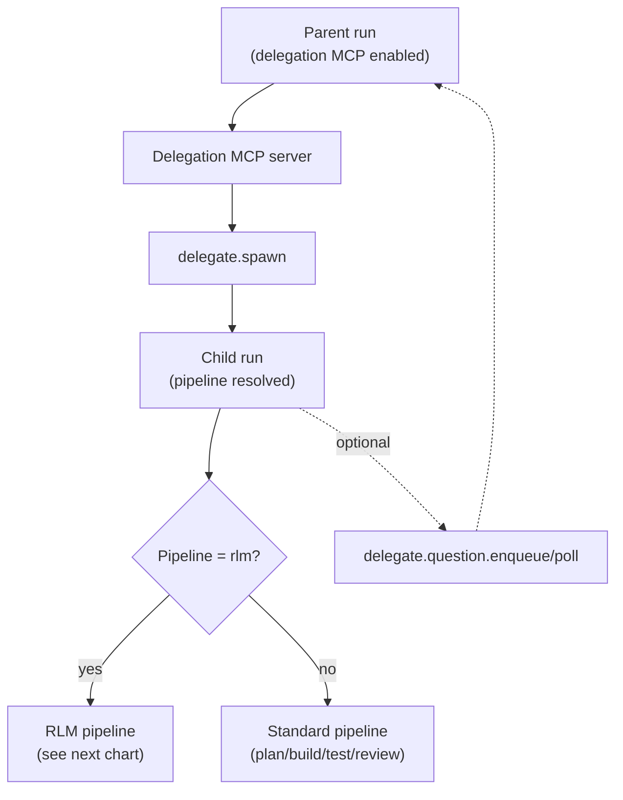
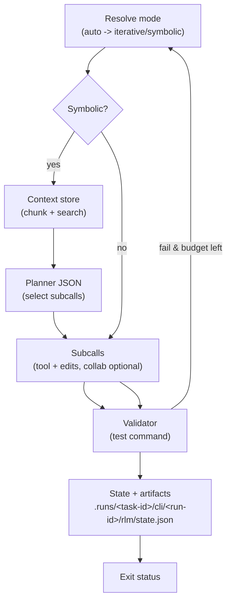
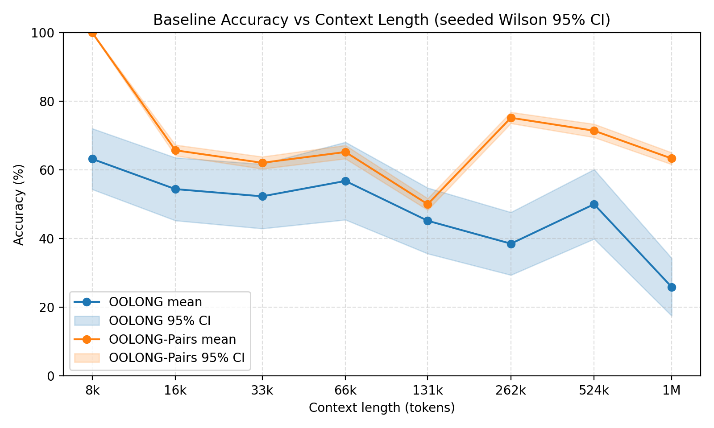
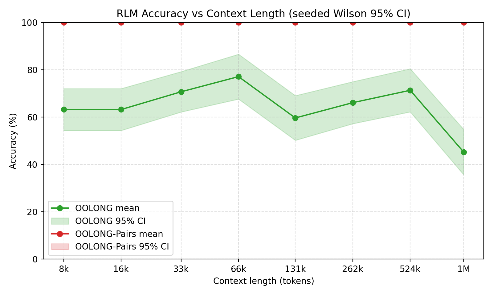

# Codex Orchestrator


Codex Orchestrator is the CLI + runtime that coordinates Codex-driven runs, pipelines, and delegation MCP tooling. The npm release focuses on running pipelines locally, emitting auditable manifests, and hosting the delegation server.

## Install

- Global install (recommended for CLI use):
  ```bash
  npm i -g @kbediako/codex-orchestrator
  ```
- After install, use either `codex-orchestrator` or the short alias `codex-orch`:
  ```bash
  codex-orchestrator --version
  ```
- Or run via npx:
  ```bash
  npx @kbediako/codex-orchestrator --version
  ```

Node.js >= 20 is required.

## Quick start

1. Run a pipeline with a task id so artifacts are grouped under `.runs/<task-id>/`:
   ```bash
   codex-orch start diagnostics --format json --task <task-id>
   ```
   The command prints the `run_id` plus the manifest path under `.runs/<task-id>/cli/<run-id>/manifest.json`.
2. Watch status:
   ```bash
   codex-orch status --run <run-id> --watch --interval 10
   ```
3. Resume if needed:
   ```bash
   codex-orch resume --run <run-id>
   ```
   > Tip: if you prefer `npx`, replace `codex-orch` with `npx @kbediako/codex-orchestrator`.
   > Tip: for multiple commands, you can also `export MCP_RUNNER_TASK_ID=<task-id>` once.

## Downstream init (recommended)

Use this when you want Codex to drive work inside another repo with the CO defaults.

1. Install templates:
   ```bash
   codex-orchestrator init codex --cwd /path/to/repo
   ```
   One-shot (templates + optional CO-managed Codex CLI install):
   ```bash
   codex-orchestrator init codex --codex-cli --yes
   ```
2. Register the delegation MCP server (one-time per machine):
   ```bash
   codex mcp add delegation -- codex-orchestrator delegate-server --repo /path/to/repo
   ```
3. Optional (managed/pinned CLI path): set up a CO-managed Codex CLI:
   ```bash
   codex-orchestrator codex setup
   ```
   Use this when you want a pinned binary, build-from-source behavior, or a custom fork.
   Stock/global `codex` is still the default selection; activate managed binary routing with:
   ```bash
   export CODEX_CLI_USE_MANAGED=1
   ```
4. Optional (fast refresh helper for downstream users):
   ```bash
   scripts/codex-cli-refresh.sh --repo /path/to/codex --align-only
   ```
   Repo-only helper (not included in npm package). Add `--no-push` when you only want local alignment and do not want to update `origin/main`. To refresh the CO-managed CLI, run a separate command with `--force-rebuild` (without `--align-only`). Set `CODEX_REPO` or `CODEX_CLI_SOURCE` to avoid passing `--repo` each time.

## Delegation MCP server

Run the delegation MCP server over stdio:
```bash
codex-orchestrator delegate-server --repo /path/to/repo
```
Optional: add `--mode question_only` to disable `delegate.spawn/pause/cancel`, keeping only `delegate.question.*` + `delegate.status` in the delegate namespace. GitHub tools remain available when GitHub integration is enabled.

Register it with Codex once. Delegation MCP is enabled by default (the only MCP enabled by default). To override the default or re-enable after disabling:
```bash
codex mcp add delegation -- codex-orchestrator delegate-server --repo /path/to/repo
codex -c 'mcp_servers.delegation.enabled=true' ...
```
`delegate-server` is the canonical name; `delegation-server` is supported as an alias (older docs may use it).

## Agent role defaults (recommended)

Codex built-ins are `default`, `explorer`, and `worker`. `researcher` is user-defined.
- `spawn_agent` defaults to `default` when `agent_type` is omitted, so always set `agent_type` explicitly when using collab subagents.

Built-in `explorer` in Codex currently uses `gpt-5.1-codex-mini` with `medium` reasoning unless you override it. If you want latest-codex defaults end-to-end, add role overrides in `~/.codex/config.toml`:

```toml
model = "gpt-5.3-codex"
model_reasoning_effort = "xhigh"

[agents]
max_threads = 8

[agents.explorer]
description = "Explorer role override (no config_file): keep built-in explorer on top-level model defaults."

[agents.explorer_fast]
description = "Fast explorer (spark text-only)."
config_file = "/absolute/path/to/.codex/agents/explorer-fast.toml"

[agents.explorer_detailed]
description = "Detailed explorer."
config_file = "/absolute/path/to/.codex/agents/explorer-detailed.toml"

[agents.worker_complex]
description = "Complex worker role."
config_file = "/absolute/path/to/.codex/agents/worker-complex.toml"
```

```toml
# ~/.codex/agents/explorer-fast.toml
model = "gpt-5.3-codex-spark"
model_reasoning_effort = "xhigh"
```

```toml
# ~/.codex/agents/explorer-detailed.toml
model = "gpt-5.3-codex"
model_reasoning_effort = "high"
```

```toml
# ~/.codex/agents/worker-complex.toml
model = "gpt-5.3-codex"
model_reasoning_effort = "xhigh"
```

Caveats:
- `gpt-5.3-codex-spark` is text-only (no image inputs). Keep it for fast search/synthesis.
- Use `max_threads = 8` as a balanced default; only move to `12` after verifying your machine/tooling stays stable under higher concurrency.

Delegation guard profile:
- `CODEX_ORCHESTRATOR_GUARD_PROFILE=auto` (default): strict in CO-style repos, warn in lightweight repos.
- Set `CODEX_ORCHESTRATOR_GUARD_PROFILE=warn` for ad-hoc/no-task-id runs.
- Set `CODEX_ORCHESTRATOR_GUARD_PROFILE=strict` to enforce full delegation evidence checks.

## Delegation + RLM flow

RLM (Recursive Language Model) is the long-horizon loop used by the `rlm` pipeline (`codex-orchestrator rlm "<goal>"` or `codex-orchestrator start rlm --goal "<goal>"`). Delegated runs only enter RLM when the child is launched with the `rlm` pipeline (or the rlm runner directly). In auto mode it resolves to symbolic only when context is large (`RLM_SYMBOLIC_MIN_BYTES`) and an explicit context signal is present (`RLM_CONTEXT_PATH` or delegated run); otherwise it stays iterative. The runner writes state to `.runs/<task-id>/cli/<run-id>/rlm/state.json` and stops when the validator passes or budgets are exhausted.
Symbolic subcalls can optionally use collab tools. Fast path: `codex-orchestrator rlm --multi-agent auto "<goal>"` (legacy alias: `--collab auto`; sets `RLM_SYMBOLIC_MULTI_AGENT=1` plus legacy `RLM_SYMBOLIC_COLLAB=1` for compatibility, and implies symbolic mode). Collab requires `multi_agent=true` in `codex features list` (`collab` remains a legacy alias). Collab tool calls parsed from `codex exec --json --enable multi_agent` are stored in `manifest.collab_tool_calls` (bounded by `CODEX_ORCHESTRATOR_COLLAB_MAX_EVENTS`, set to `0` to disable). For auditable role routing, prefix spawned prompts with `[agent_type:<role>]` and set `spawn_agent.agent_type` when supported; lifecycle validation enforces prompt-role evidence and validates `agent_type` when present (`RLM_SYMBOLIC_MULTI_AGENT_ROLE_POLICY=warn|off`, legacy alias `RLM_COLLAB_ROLE_POLICY`; `RLM_SYMBOLIC_MULTI_AGENT_ALLOW_DEFAULT_ROLE=1`, legacy alias `RLM_COLLAB_ALLOW_DEFAULT_ROLE`). `codex-orchestrator codex setup` remains available when you want a managed/pinned CLI path (opt-in via `CODEX_CLI_USE_MANAGED=1`).

### Delegation flow


### RLM loop


## Skills (bundled)

Recommended one-shot bootstrap (skills + delegation + DevTools wiring):
```bash
codex-orchestrator setup --yes
```

The release ships skills under `skills/` for downstream packaging. If you already have global skills installed, treat those as the primary reference and use bundled skills as the shipped fallback. Install bundled skills into `$CODEX_HOME/skills`:
```bash
codex-orchestrator skills install
```

Options:
- `--force` overwrites existing files.
- `--only <skills>` installs only selected skills (comma-separated). Combine with `--force` to overwrite only those.
- `--codex-home <path>` targets a different Codex home directory.

Bundled skills (may vary by release):
- `collab-subagents-first`
- `chrome-devtools`
- `delegation-usage`
- `standalone-review`
- `docs-first`
- `collab-evals`
- `collab-deliberation`
- `release`
- `delegate-early` (compatibility alias; use `delegation-usage`)

## DevTools readiness

Check readiness (deps + capability wiring):
```bash
codex-orchestrator doctor --format json
```

Auto-fix wiring (delegation + DevTools):
```bash
codex-orchestrator doctor --apply --yes
```

Usage snapshot (scans local `.runs/`):
```bash
codex-orchestrator doctor --usage
```
`doctor --usage` prints adoption KPIs (advanced/cloud/rlm/collab/delegation coverage), and per-run `run-summary.json` now includes a `usageKpi` section plus cloud fallback metadata when preflight downgrades to MCP.

## Downstream usage cheatsheet (agent-first)

- Bootstrap + wire everything: `codex-orchestrator setup --yes`
- Low-friction docs->implementation guardrails: `codex-orchestrator flow --task <task-id>`
- Validate + measure adoption locally: `codex-orchestrator doctor --usage --format json`
- Delegation: `codex-orchestrator doctor --apply --yes`, then enable for a Codex run with: `codex -c 'mcp_servers.delegation.enabled=true' ...`
- Collab (symbolic RLM subagents): `codex-orchestrator rlm --multi-agent auto "<goal>"` (legacy alias: `--collab auto`; requires Codex `features.multi_agent=true`)
- Cloud: set `CODEX_CLOUD_ENV_ID` (and optional `CODEX_CLOUD_BRANCH`), then run: `codex-orchestrator start <pipeline> --cloud --target <stage-id>`

Print DevTools MCP setup guidance:
```bash
codex-orchestrator devtools setup
```

## Common commands

- `codex-orchestrator start <pipeline>` — run a pipeline.
- `codex-orchestrator flow --task <task-id>` — run `docs-review` then `implementation-gate` in sequence.
- `codex-orchestrator plan <pipeline>` — preview pipeline stages.
- `codex-orchestrator exec <cmd>` — run a one-off command with the exec runtime.
- `codex-orchestrator init codex` — install starter templates (`mcp-client.json`, `AGENTS.md`) into a repo.
- `codex-orchestrator setup --yes` — install bundled skills and configure delegation + DevTools wiring.
- `codex-orchestrator init codex --codex-cli --yes --codex-source <path>` — optionally provision a CO-managed Codex CLI binary (build-from-source default; set `CODEX_CLI_SOURCE` to avoid passing `--codex-source` every time, and `CODEX_CLI_USE_MANAGED=1` to route runs to it).
- `codex-orchestrator init codex --codex-cli --yes --codex-download-url <url> --codex-download-sha256 <sha>` — opt-in to a prebuilt Codex CLI download.
- `codex-orchestrator codex setup` — plan/apply a CO-managed Codex CLI install (optional managed/pinned path; use `--download-url` + `--download-sha256` for prebuilts; activate with `CODEX_CLI_USE_MANAGED=1`).
- `codex-orchestrator delegation setup --yes` — configure delegation MCP server wiring.
- `codex-orchestrator self-check --format json` — JSON health payload.
- `codex-orchestrator mcp serve` — Codex MCP stdio server.

## What ships in the npm release

- CLI + built-in pipelines
- Delegation MCP server (`delegate-server`)
- Bundled skills under `skills/`
- Schemas and templates needed by the CLI

## Repository + contributor guide

Repo internals, development workflows, and deeper architecture notes (contributor/internal) live in the GitHub repository:
- `docs/README.md`
- `docs/diagnostics-prompt-guide.md` (first-run diagnostics prompt + expected outputs)
- `docs/guides/collab-vs-mcp.md` (agent-first decision guide)
- `docs/guides/rlm-recursion-v2.md` (RLM recursion reference)
- `docs/guides/cloud-mode-preflight.md` (cloud-mode preflight + fallback guidance)
- `docs/guides/review-artifacts.md` (where `npm run review` writes prompt/output artifacts)

## RLM benchmark graphs

Seeded OOLONG accuracy curves (Wilson 95% CI, runs=5). In these runs, the baseline accuracy degrades as context length grows, while RLM stays near the ceiling across the tested lengths.

<table>
  <tr>
    <td></td>
    <td></td>
  </tr>
</table>
