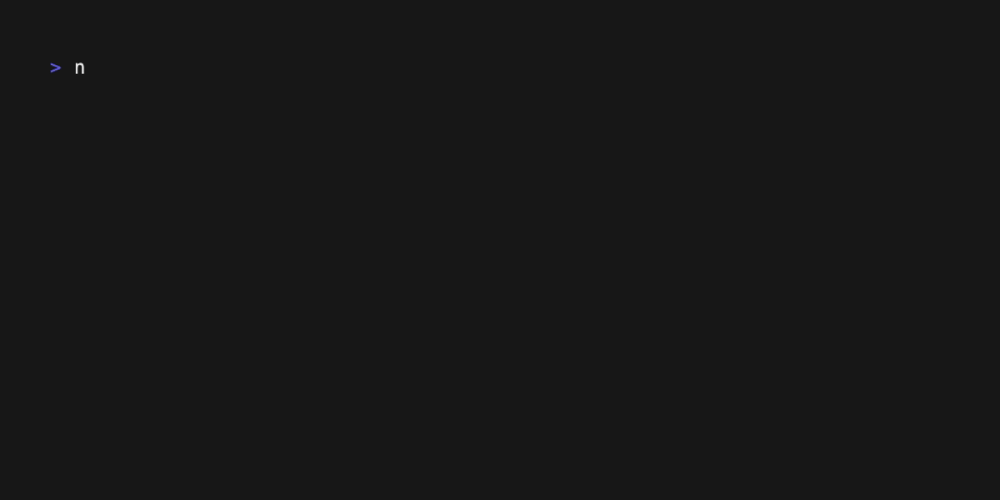
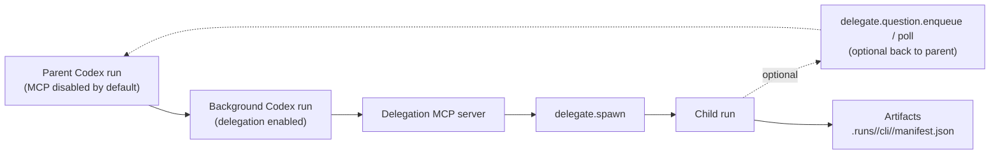

# Codex Orchestrator



Codex Orchestrator is the CLI + runtime that coordinates Codex-driven runs, pipelines, and delegation MCP tooling. The npm release focuses on running pipelines locally, emitting auditable manifests, and hosting the delegation server.

## Install

- Global install (recommended for CLI use):
  ```bash
  npm i -g @kbediako/codex-orchestrator
  ```
- After install, use either `codex-orchestrator` or the short alias `codex-orch`:
  ```bash
  codex-orchestrator --version
  ```
- Or run via npx:
  ```bash
  npx @kbediako/codex-orchestrator --version
  ```

Node.js >= 20 is required.

## Quick start

1. Run a pipeline with a task id so artifacts are grouped under `.runs/<task-id>/`:
   ```bash
   codex-orch start diagnostics --format json --task <task-id>
   ```
   The command prints the `run_id` plus the manifest path under `.runs/<task-id>/cli/<run-id>/manifest.json`.
2. Watch status:
   ```bash
   codex-orch status --run <run-id> --watch --interval 10
   ```
3. Resume if needed:
   ```bash
   codex-orch resume --run <run-id>
   ```
   > Tip: if you prefer `npx`, replace `codex-orch` with `npx @kbediako/codex-orchestrator`.
   > Tip: for multiple commands, you can also `export MCP_RUNNER_TASK_ID=<task-id>` once.

## Delegation MCP server

Run the delegation MCP server over stdio:
```bash
codex-orchestrator delegate-server --repo /path/to/repo
```
Optional: add `--mode question_only` to disable `delegate.spawn/pause/cancel`, keeping only `delegate.question.*` + `delegate.status` in the delegate namespace. GitHub tools remain available when GitHub integration is enabled.

Register it with Codex once, then enable per run:
```bash
codex mcp add delegation -- codex-orchestrator delegate-server --repo /path/to/repo
codex -c 'mcp_servers.delegation.enabled=true' ...
```
`delegate-server` is the canonical name; `delegation-server` is supported as an alias (older docs may use it).

## Delegation flow



## Skills (bundled)

The release ships skills under `skills/`. Install them into `$CODEX_HOME/skills`:
```bash
codex-orchestrator skills install
```

Options:
- `--force` overwrites existing files.
- `--codex-home <path>` targets a different Codex home directory.

Bundled skills (may vary by release):
- `delegation-usage`

## DevTools readiness

Check DevTools readiness (skill + MCP config):
```bash
codex-orchestrator doctor --format json
```

Print DevTools MCP setup guidance:
```bash
codex-orchestrator devtools setup
```

## Common commands

- `codex-orchestrator start <pipeline>` — run a pipeline.
- `codex-orchestrator plan <pipeline>` — preview pipeline stages.
- `codex-orchestrator exec <cmd>` — run a one-off command with the exec runtime.
- `codex-orchestrator self-check --format json` — JSON health payload.
- `codex-orchestrator mcp serve` — Codex MCP stdio server.

## What ships in the npm release

- CLI + built-in pipelines
- Delegation MCP server (`delegate-server`)
- Bundled skills under `skills/`
- Schemas and templates needed by the CLI

## Repository + contributor guide

Repo internals, development workflows, and deeper architecture notes live in the GitHub repository:
- `docs/README.md`
