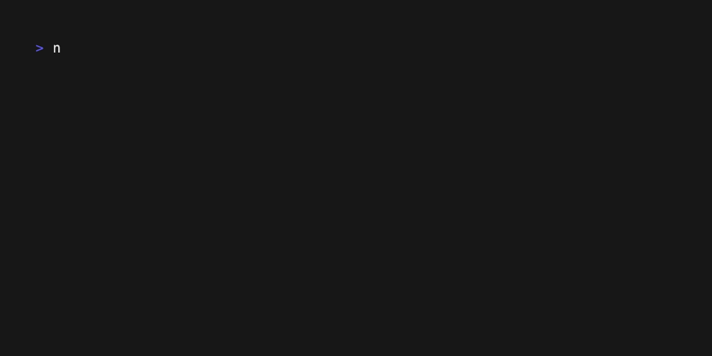

# Codex Orchestrator



Codex Orchestrator is the CLI + runtime for Codex-driven pipelines, auditable manifests, and delegation MCP workflows. The npm release is the downstream entrypoint; contributor and repo-internal detail lives in `docs/README.md`.

## Install

- Global install (recommended for CLI use):
  ```bash
  npm i -g @kbediako/codex-orchestrator
  ```
- After install, use either `codex-orchestrator` or the short alias `codex-orch`:
  ```bash
  codex-orchestrator --version
  ```
- Or run via npx:
  ```bash
  npx @kbediako/codex-orchestrator --version
  ```

Node.js >= 20 is required.

## Quick start

1. Start a pipeline with a task id so artifacts land under `.runs/<task-id>/`:
   ```bash
   codex-orch start diagnostics --format json --task <task-id>
   ```
2. Watch the run:
   ```bash
   codex-orch status --run <run-id> --watch --interval 10
   ```
3. Resume if needed:
   ```bash
   codex-orch resume --run <run-id>
   ```
   The command prints the `run_id` plus the manifest path under `.runs/<task-id>/cli/<run-id>/manifest.json`.
4. One-shot downstream bootstrap:
   ```bash
   codex-orchestrator setup --yes
   ```

## Current posture

- Current CO compatibility or adoption target: Codex CLI `0.117.0`.
- Current model posture: `gpt-5.4` for top-level, delegated subagent, and review surfaces.
- `explorer_fast` remains the only explicit `gpt-5.3-codex-spark` exception.
- Local default runtime is `appserver`; keep `--runtime-mode cli` as break-glass.
- `executionMode=cloud` with explicit `runtimeMode=appserver` is unsupported and fails fast.
- Full posture and evidence gates live in `docs/guides/codex-version-policy.md`.

## Downstream setup

Use this when you want Codex to work inside another repo with the CO defaults.

1. Seed templates:
   ```bash
   codex-orchestrator init codex --cwd /path/to/repo
   ```
2. Register delegation MCP once per machine:
   ```bash
   codex mcp add delegation -- codex-orchestrator delegate-server --repo /path/to/repo
   ```
3. Optional managed Codex CLI path:
   ```bash
   codex-orchestrator codex setup
   export CODEX_CLI_USE_MANAGED=1
   ```
4. Optional additive global defaults:
   ```bash
   codex-orchestrator codex defaults --yes
   ```

For deeper runtime, cloud, and role guidance, use `docs/README.md` and `skills/delegation-usage/SKILL.md`.

## Skills (bundled)

Recommended one-shot bootstrap (skills + delegation + DevTools wiring):
```bash
codex-orchestrator setup --yes
# Optional: overwrite existing bundled skills in $CODEX_HOME/skills
# codex-orchestrator setup --yes --refresh-skills
```

The release ships skills under `skills/` for downstream packaging. If you already have global skills installed, treat those as the primary reference and use bundled skills as the shipped fallback. Install bundled skills into `$CODEX_HOME/skills`:
```bash
codex-orchestrator skills install
```

Options:
- `--force` overwrites existing files.
- `--only <skills>` installs only selected skills (comma-separated). Combine with `--force` to overwrite only those.
- `--codex-home <path>` targets a different Codex home directory.

Bundled skills (current shipped roster):
- `agent-first-adoption-steering`
- `chrome-devtools`
- `codex-orchestrator`
- `collab-deliberation`
- `collab-evals`
- `collab-subagents-first`
- `delegate-early` (compatibility alias; use `delegation-usage`)
- `delegation-usage`
- `docs-first`
- `elegance-review`
- `land`
- `linear`
- `long-poll-wait`
- `release`
- `standalone-review`

## Common workflows

- Doctor and readiness:
  - `codex-orchestrator doctor --format json`
  - `codex-orchestrator doctor --apply --yes`
  - `codex-orchestrator doctor --usage`
- Pipelines and review:
  - `codex-orchestrator flow --task <task-id>`
  - `codex-orchestrator start docs-relevance-advisory --task <task-id>`
  - `NOTES="Goal: ... | Summary: ... | Risks: ..." codex-orchestrator review --task <task-id>`
- Monitoring and issue bundles:
  - `codex-orchestrator co-status`
  - `codex-orchestrator co-status attach`
  - `codex-orchestrator doctor --issue-log --issue-title "<title>" --issue-notes "<notes>"`
  - `codex-orchestrator start <pipeline> --auto-issue-log`
- Packaging and release checks:
  - `npm run pack:smoke`
  - `npm run pack:audit`

## More docs

- `docs/README.md`: repository guide, contributor workflows, and deeper command reference.
- `docs/guides/codex-version-policy.md`: current posture and promotion gates.
- `docs/skills-release.md`: bundled skill install and release expectations.
- `docs/standalone-review-guide.md`: review wrapper behavior and downstream-safe review usage.
- `skills/delegation-usage/SKILL.md`: delegation defaults and downstream workflow guidance.
