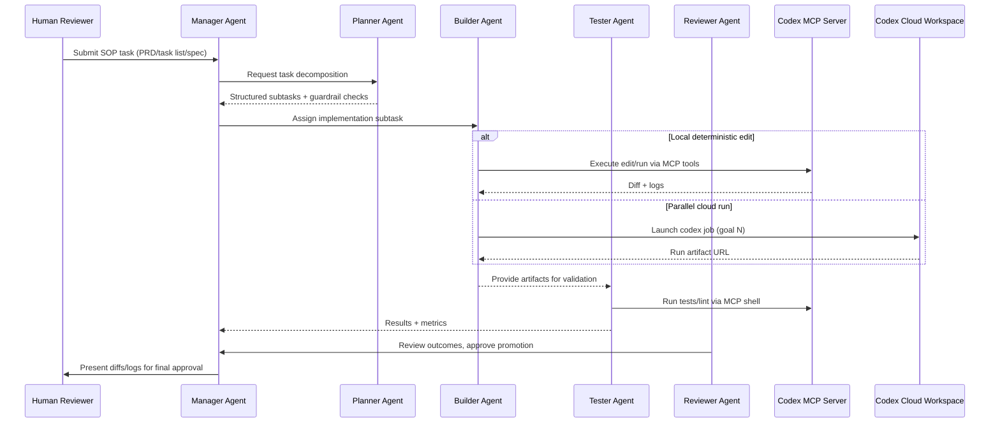

# Codex-Orchestrator Technical Specification
last_review: 2025-10-16

## Added by Orchestrator 2025-10-16

### Metadata
- **Relates to:** `tasks/0001-prd-codex-orchestrator.md`
- **Connected Mini-Spec:** `tasks/specs/0001-orchestrator-architecture.md`
- **Status:** Approved (Architecture Steward sign-off 2025-10-16)
- **Authors:** Orchestrator Engineering
- **Last Updated:** 2025-10-16

## 1. Scope & Objectives
- Deliver an Agents SDK-based orchestration layer that enforces Codex SOP phases, review gates, and artifact mirroring.
- Support two execution modes:
  - **Local deterministic editing:** Call Codex as an MCP server via `codex mcp-server`.
  - **Parallel cloud delivery:** Use Codex Cloud APIs to spawn concurrent managed runs.
- Provide reusable “learnings” assets (codemods, linters, templates) plus language adapters and an evaluation harness to validate automation outcomes.

## 2. Architectural Overview


- **Manager Agent:** Orchestrates SOP phases, enforces one-subtask rule, syncs state to `/tasks/index.json`.
- **Planner Agent:** Reads PRD/task list, proposes subtask execution order, ensures mini-spec gating satisfied.
- **Builder Agent:** Executes code edits via MCP (preferred) or Codex Cloud workflows; shells out using approved commands only.
- **Tester Agent:** Runs lint/tests/evaluations; publishes results under `.runs`.
- **Reviewer Agent:** Aggregates evidence, checks guardrails, formats human-facing summaries.
- **Cloud-Sync Worker:** Listens for `RunCompleted` events, mirrors manifests to Codex Cloud, and records sync receipts in `/out/audit.log`.
- **Credential Broker:** Fetches Vault-scoped secrets at runtime and hands short-lived tokens to agents without persisting to disk.

```mermaid
flowchart TD
    subgraph Local Repository
        Manager -->|RunCompleted| EventBus
        EventBus --> CloudSync[Cloud-Sync Worker]
        Manager --> StateStore[TaskStateStore]
        StateStore --> Manifest[.runs/<ts>/manifest.json]
    end
    CloudSync -->|Upload| CloudRuns[Codex Cloud Runs API]
    CloudSync --> Audit[/out/audit.log]
    CredentialBroker[Credential Broker] --> Manager
    CredentialBroker --> CloudSync
```

### Component Responsibilities
- **Manager:** Owns orchestration state machine, emits events, and selects execution mode.
- **Event Bus:** Lightweight in-memory dispatcher (Node `EventEmitter`) that forwards lifecycle events to subscribers such as the `cloud-sync` worker.
- **Cloud-Sync Worker:** Streams manifest payloads to Codex Cloud with idempotency keys derived from `run_id` hashes.
- **Credential Broker:** Wraps Vault client and presents scoped tokens to MCP/Cloud integrations.
- **TaskStateStore:** Persists manifests locally and exposes read APIs for downstream reporting.

## 3. Agent Implementation Details
- **Agents SDK Usage:**
  - Manager holds shared context (PRD metadata, gate status, artifact paths).
  - Each peer agent exposes `perform(taskContext)` returning typed results (diffs, metrics, approvals).
  - Shared toolset includes filesystem read, git diff, npm scripts, spec guard checker.
- **State Persistence:**
  - `orchestrator/src/state/TaskStateStore.ts` persists JSON manifests per task id (e.g., `/out/0001/state.json`).
  - `TaskStateStore` writes atomic snapshots to avoid partial updates; concurrency handled via advisory lock file `.runs/0001.lock`.
- **Error Handling:**
  - Wrap external command execution with retry/backoff (max 2 retries) and guardrail reconsideration.
  - Manager escalates to human if guardrail breach or repeated failure occurs.

## 4. MCP vs Codex SDK Integration
- **Local MCP Path (default):**
  - Script `scripts/run-local-mcp.sh` spawns `codex mcp-server` with orchestrator repository mounted.
  - Builder agent connects via MCP transport, uses `edit`, `run`, and `git` tools; responses archived under `.runs/<timestamp>/`.
- **Cloud Parallelism Path:**
  - `scripts/run-parallel-goals.ts` uses Codex SDK to launch multiple goals (builder/tester/reviewer) in Codex Cloud.
  - Each goal runs with safe approval modes; artifacts fetched via Cloud run export API then ingested back into manager state.
- **Mode Selection:**
  - Manager inspects task metadata; use MCP for deterministic diffs, Cloud for long-running or resource-intensive tasks.
  - Document environment variables `CODEX_MODE={mcp|cloud}` and `CLOUD_WORKSPACE_ID`.

### Mode Selection Policy
- Default to MCP unless `task.metadata.execution.parallel === true` or a subtask tags `requires_cloud`.
- Record the chosen mode in the run manifest (`mode.used`) for analytics and audit trails.
- Allow manual override via CLI flag `--mode cloud` which Manager validates against guardrail approvals.

## 5. Learning Assets Library
- Structure: `patterns/{codemods,linters,templates}` with `index.json` summarizing asset metadata (name, version, description, usage).
- Codemods implemented via jscodeshift transforms; stored with README and sample before/after.
- Linters implemented as ESLint custom rules, bundled via `patterns/linters/index.ts`.
- Templates provide markdown or code scaffolds for repeated responses (e.g., spec prompts).
- Learning ingestion flow records new assets in `/tasks/index.json` `specs` array (`status: planned|in-progress|done`).

## 6. Adapter Layer
- Directory: `adapters/<language>/build-test-configs`.
- Each adapter exports `buildCommand`, `testCommand`, `env` metadata consumed by Builder/Tester.
- Support TypeScript by default; document swap to Python Agents SDK: install `@openai/agents-python` (hypothetical) and instantiate `PythonAgentRuntime` in manager config.
- Provide fallback script `scripts/adapter-sync.ts` to validate adapter definitions.

## 7. Evaluation Harness
- `evaluation/harness/index.ts` orchestrates scenario runs applying codemods/linters to sample repositories.
- Fixtures stored under `evaluation/fixtures/<repo>/<scenario>.json`.
- Tester agent triggers evaluation via `npm run eval:test`; results persisted under `.runs/<timestamp>/evaluation.json`.
- Provide baseline thresholds (e.g., ≥95% automated fixes apply cleanly).

## 8. Run Metadata Synchronization
- Manager emits `RunCompleted` events with manifest references (`task_id`, `run_id`, `mode`, `artifacts`).
- Cloud-sync worker validates manifests, uploads summaries to Codex Cloud Runs API, and stores sync receipts in `/out/audit.log`.
- Sync retries: exponential backoff (max 3 attempts) with failure escalation to Reviewer agent for human follow-up.
- Idempotency: use manifest hash (`sha256(task_id + run_id)`) to skip duplicate uploads.
- Configuration: `CODEX_CLOUD_SYNC=true|false`, `CLOUD_SYNC_VAULT_PATH`, `CLOUD_SYNC_BUCKET`.

## 9. Observability & Logging
- All agents use shared logger writing to `.runs/<timestamp>/orchestrator.log`.
- Guardrail events (escalations, approval changes) mirrored to `/out/audit.log`.
- When running in Codex Cloud, capture run IDs and link them in `/tasks/index.json` metadata.

## 10. Security & Approval Workflow
- Default approval policy: safe `read/edit/run/network`.
- Escalations require human confirmation recorded in state manifest.
- Secrets sourced from Vault paths `secret/codex/orchestrator/<env>` via credential broker; tokens stay in memory and are rotated every run.
- Spec guard script ensures mini-spec `last_review` <= 30 days before touching `src/` or `migrations/`.

## 11. Example Session (MCP Mode)
1. Human invokes manager with Task ID 0001.
2. Manager verifies PRD + task list statuses and mini-spec approvals.
3. Planner generates subtask `Implement Logger`.
4. Builder executes `edit` via MCP to add logging module; diffs saved to `.runs/0001/<timestamp>/diff.patch`.
5. Tester runs `npm test`; results appended to `.runs/0001/<timestamp>/test.json`.
6. Reviewer summarizes outcome, updates `/tasks/index.json` status to `in-progress`, and awaits human sign-off.

## 12. Alternative Language Option (Python)
- Replace `orchestrator/src` TypeScript agents with Python equivalents using Agents SDK Python bindings.
- Introduce `adapters/python/build-test-configs` mapping to `poetry install` / `pytest`.
- Document swap procedure and compatibility matrix in `AGENTS.md`.

## 13. Review Decisions 2025-10-16
- Adopted Vault-backed credential broker and `cloud-sync` worker pattern to keep secrets ephemeral and mirror manifests safely.
- Mode selection recorded per run; overrides require explicit CLI flag and guardrail check.
- Codex Cloud mirrors rely on manifest hashes for idempotency and are audited in `/out/audit.log`.

## 14. Approvals
- **Engineering Lead:** Architecture Steward (Codex) — 2025-10-16
- **Security Reviewer:** Security Representative (Codex) — 2025-10-16
- **DX/Docs Reviewer:** Docs Steward (Codex) — 2025-10-16
